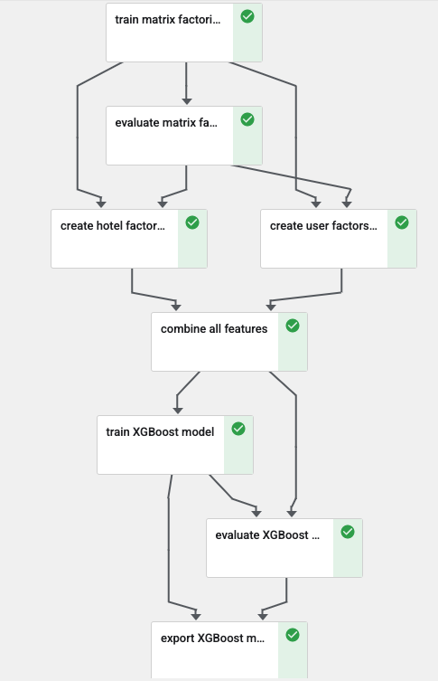

```python
# Copyright 2020 Google LLC
#
# Licensed under the Apache License, Version 2.0 (the "License");
# you may not use this file except in compliance with the License.
# You may obtain a copy of the License at
#
#     https://www.apache.org/licenses/LICENSE-2.0
#
# Unless required by applicable law or agreed to in writing, software
# distributed under the License is distributed on an "AS IS" BASIS,
# WITHOUT WARRANTIES OR CONDITIONS OF ANY KIND, either express or implied.
# See the License for the specific language governing permissions and
# limitations under the License.
```

## Tutorial Overview 

This is a three part tutorial where part one will walk you through a complete end to end Machine Learning use case using Google Cloud Platform. You will learn how to build a hybrid recommendation model with embedding technique with Google BigQuery Machine Learning from book [“BigQuery: The Definitive Guide”](https://www.amazon.com/Google-BigQuery-Definitive-Warehousing-Analytics/dp/1492044466), a highly recommended book written by BigQuery and ML expert Valliappa Lakshmanan. We will not cover in detail on typical machine learining steps such data exploration and cleaning, feature selection, and feature engineering (other than embedding technique we show here). We encourage the readers to do so and see if you can improve the model quality and performance. Instead we will mostly focus on show you how to orchestrate the entire machine learning process with Kubeflow on Google AI Platform Pipelines. In [PART TWO](part_2/README.md), you will learn how to setup a CI/CD pipeline with Google Cloud Source Repositories and Google Cloud Build.  In [PART THREE](part_3/README.md), you will learn how to run the same code in Part One (with minor changes) in Google's new Vertex AI pipeline.   

The use case is to predict the the propensity of booking for any user/hotel combination. The intuition behind the embedding layer with Matrix Factorization is if we can find similar hotels that are close in the embedding space, we will achieve a higher accuracy to predict whether the user will book the hotel. 



## Getting Started
Use this [notebook](kfp_tutorial.ipynb) to get started. 

## Questions? Feedback?
If you have any questions or feedback, please open up a [new issue](https://github.com/GoogleCloudPlatform/analytics-componentized-patterns/issues).
