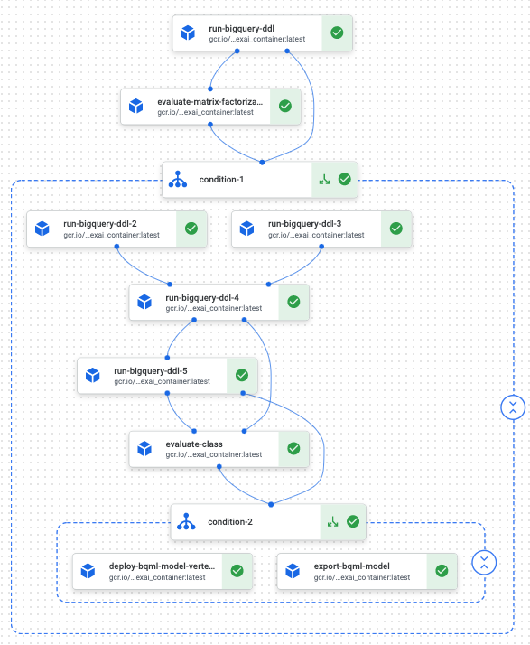

```python
# Copyright 2020 Google LLC
#
# Licensed under the Apache License, Version 2.0 (the "License");
# you may not use this file except in compliance with the License.
# You may obtain a copy of the License at
#
#     https://www.apache.org/licenses/LICENSE-2.0
#
# Unless required by applicable law or agreed to in writing, software
# distributed under the License is distributed on an "AS IS" BASIS,
# WITHOUT WARRANTIES OR CONDITIONS OF ANY KIND, either express or implied.
# See the License for the specific language governing permissions and
# limitations under the License.
```

## Tutorial Overview 

This is part three of the tutorial where you will learn how to run same code in [Part One](../README.md) (with minor changes) in Google's new Vertex AI pipeline. Vertex Pipelines helps you to automate, monitor, and govern your ML systems by orchestrating your ML workflow in a serverless manner, and storing your workflow's artifacts using Vertex ML Metadata. By storing the artifacts of your ML workflow in Vertex ML Metadata, you can analyze the lineage of your workflow's artifacts — for example, an ML model's lineage may include the training data, hyperparameters, and code that were used to create the model.

You will also learn how to export the final BQML model and hosted on the Google Vertex AI Endpoint. 



## Getting Started
Use this [notebook](vertex_ai_pipeline.ipynb) to get started. 

## Questions? Feedback?
If you have any questions or feedback, please open up a [new issue](https://github.com/GoogleCloudPlatform/analytics-componentized-patterns/issues).
