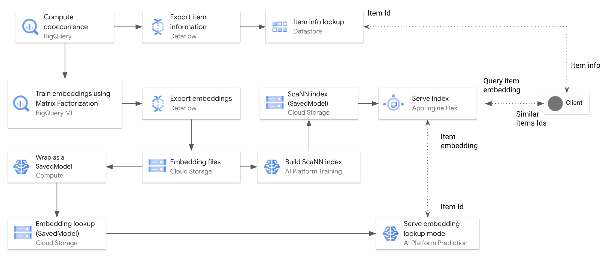

# Real-time Item-to-item Recommendation BigQuery ML Matrix Factorization and ScaNN

This directory contains a sample code for training and serving embeddings 
for real-time similarity matching. The system utilizes [BigQuery ML Matrix Factorization](https://cloud.google.com/bigquery-ml/docs/reference/standard-sql/bigqueryml-syntax-create-matrix-factorization)
model to train the embeddings, and the open-source [ScaNN framework](https://ai.googleblog.com/2020/07/announcing-scann-efficient-vector.html) to build and
approximate nearest neighbour index.

1. Compute pointwise mutual information (PMI) between items based on their cooccurrences.
2. Train item embeddings using BigQuery ML Matrix Factorization, with item PMI as implicit feedback.
3. Export and post-process the embeddings from BigQuery ML model to Cloud Storage as CSV files using Cloud Dataflow.
4. Implement an embedding lookup model using Keras and deploy it to AI Platform Prediction.
5. Serve the embedding as an approximate nearest neighbor index using ScaNN on AI Platform Prediction for real-time similar items matching.




## Before you begin

Complete the following steps to set up your GCP environment:

1. In the [Cloud Console, on the project selector page](https://console.cloud.google.com/projectselector2/home/dashboard), select or create a Cloud project.
2. Make sure that [billing is enabled](https://cloud.google.com/billing/docs/how-to/modify-project) for your Google Cloud project. 
3. [Enable the APIs](https://console.cloud.google.com/apis/library)
 required for the solution: Compute Engine, Dataflow, AI Platform.
4. [Create an AI Notebook Instance](https://cloud.google.com/ai-platform/notebooks/docs/create-new)  with TensorFlow 2.2 runtime.


To go through the tasks for running the solution, you need to open the JupyterLab environment in the AI Notebook and clone the repository.

1. In the AI Platform Notebook list, click Open Jupyterlab. This opens the JupyterLab environment in your browser.

2. To launch a terminal tab, click the Terminal icon from the Launcher menu.

3. In the terminal, clone the `analytics-componentized-patterns` repository:

    ```git clone https://github.com/GoogleCloudPlatform/analytics-componentized-patterns.git```

When the command finishes, navigate to the `analytics-componentized-patterns/retail/recommendation-system/bqml-scann` directory in the file browser.


## Using the Notebooks to Run the Solution

We provide the following notebooks to run the steps of the solutions:

[00_import_bq_to_datastore.ipynb](00_import_bq_to_datastore.ipynb) - 
This is a prerequisite note book that you can use to:
 1. Copy the `bigquery-samples dataset.playlists` public data to your dataset.
 We use the playlist data to create embeddings for songs based on their cooccurrences
 in different playlist.
 2. Export the songs information to Datastore so that you can lookup the information
  of a given song in a timely fashion, rather than querying BigQuery.
  
[01_train_bqml_mf_pmi.ipynb](01_train_bqml_mf_pmi.ipynb) - This notebook covers
 the following steps: 
1. Explore the BigQuery data based on the `bigquery-samples dataset.playlists` dataset.
2. Compute pairwise item cooccurrences. 
3. Train a Matrix Factorization model using BigQuery ML.
4. Explore the trained embeddings.
 
[02_export_bqml_mf_embeddings.ipynb](02_export_bqml_mf_embeddings.ipynb) - 
This notebook covers exporting the trained embeddings from the Matrix Factorization BigQuery ML Model to Cloud Storage,
as CSV files, using Apache Beam and Cloud Dataflow.

[03_deploy_embeddings_lookup_caip.ipynb](03_deploy_embeddings_lookup_caip.ipynb) - 
This notebook covers wrapping the item embeddings in a Keras model, exporting it
as a SavedModel, and serving the embeddings in Cloud AI Platform Prediction as an item-embedding lookup.

[04_build_embeddings_scann.ipynb](04_build_embeddings_scann.ipynb) - 
This notebook covers building an approximate nearest neighbor index for the embeddings 
using ScaNN and AI Platform Training. The built ScaNN index then is stored in Cloud Storage.

[05_serve_scann_for_matching_caip.ipynb](05_serve_scann_for_matching_caip.ipynb) - 
This notebook covers deploying the ScaNN index to AI Platform Prediction with a custom container for real-time similar item matching. 
The matching service works as follows:
1. Accepts a query item Id.
2. Looks up the embedding of the query item Id from Embedding Lookup Model in AI Platform Prediction.
3. Uses the ScaNN index to find similar item Ids for the given query item embedding.
4. Returns a list of the similar item Ids to the query item Id.


## License

Copyright 2020 Google LLC

Licensed under the Apache License, Version 2.0 (the "License");
you may not use this file except in compliance with the License. You may obtain a copy of the License at: http://www.apache.org/licenses/LICENSE-2.0

Unless required by applicable law or agreed to in writing, software distributed under the License is distributed on an "AS IS" BASIS, WITHOUT WARRANTIES OR CONDITIONS OF ANY KIND, either express or implied. 

See the License for the specific language governing permissions and limitations under the License.

**This is not an official Google product but sample code provided for an educational purpose**

