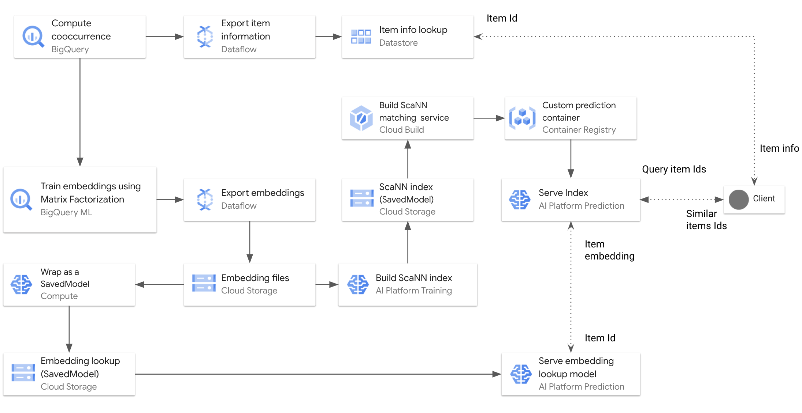
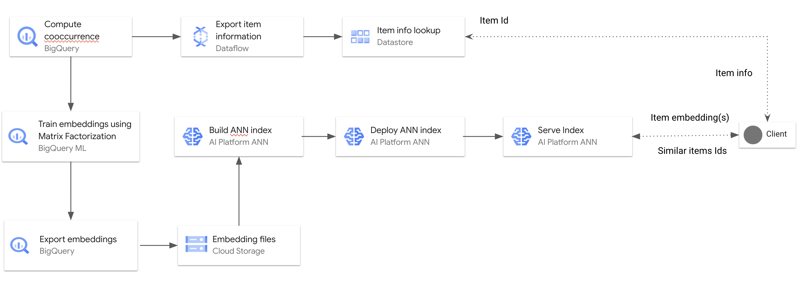
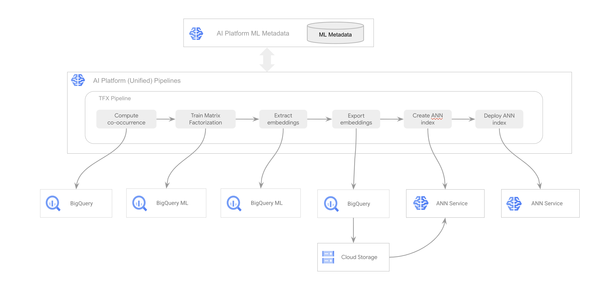

# Real-time Item-to-item Recommendation with BigQuery ML Matrix Factorization and ScaNN

This directory contains code samples that demonstrate how to implement a low
latency item-to-item recommendation solution, by training and serving embeddings
that you can use to enable real-time similarity matching. The foundations of the
solution are [BigQuery](https://cloud.google.com/bigquery) and
[ScaNN](https://github.com/google-research/google-research/tree/master/scann),
which is an open source library for efficient vector similarity search at scale.

The series is for data scientists and ML engineers who want to build an
embedding training system and serve for item-item recommendation use cases. It
assumes that you have experience with Google Cloud,
[BigQuery](https://cloud.google.com/bigquery), [AI
Platform](https://cloud.google.com/ai-platform),
[Dataflow](https://cloud.google.com/dataflow),
[Datastore](https://cloud.google.com/datastore), and with
[Tensorflow](https://www.tensorflow.org/) and [TFX
Pipelines](https://www.tensorflow.org/tfx).

## Solution variants

There are two variants of the solution:

-  The first variant utilizes generally available releases of BigQuery and
   AI Platform together with open source components including ScaNN and
   [Kubeflow Pipelines](https://www.kubeflow.org/docs/pipelines/overview/pipelines-overview/).
   To use this variant, follow the instructions in the [Production
   variant](#production-variant) section.
-  The second variant is a fully-managed solution that leverages the
   _experimental_ releases of AI Platform Pipelines and ANN service. To use this
   variant, follow the instructions in the [Experimental
   variant](#experimental-variant) section.

## Dataset

We use the public `bigquery-samples.playlists` BigQuery dataset to demonstrate the
solutions. We use the playlist data to learn embeddings for songs based on their
co-occurrences in different playlists. The learned embeddings can be used to
match and recommend relevant songs to a given song or playlist.

## Production variant

At a high level, the solution works as follows:

1. Computes pointwise mutual information (PMI) between items based on their
   co-occurrences.
1. Trains item embeddings using BigQuery ML Matrix Factorization, with item
   PMI as implicit feedback.
1. Using Cloud Dataflow, post-processes the embeddings into CSV files and
   exports them from the BigQuery ML model to Cloud Storage.
1. Implements an embedding lookup model using TensorFlow Keras, and then
   deploys it to AI Platform Prediction.
1. Serves the embeddings as an approximate nearest neighbor index on AI
   Platform Prediction for real-time similar items matching.



For a detailed description of the solution architecture, see
[Architecture of a machine learning system for item matching](https://cloud.google.com/solutions/real-time-item-matching).

### Cost

The solution uses the following billable components of Google Cloud:

-  AI Platform Notebooks
-  AI Platform Pipelines
-  AI Platform Prediction
-  AI Platform Training
-  Artifact Registry
-  BigQuery
-  Cloud Build
-  Cloud Storage
-  Dataflow
-  Datastore

To learn about Google Cloud pricing, use the [Pricing
Calculator](https://cloud.google.com/products/calculator) to generate a cost
estimate based on your projected usage.

### Running the solution

You can run the solution step-by-step, or you can run it by using a TFX
pipeline. 

#### Run the solution step-by-step

1. Complete the steps in [Set up the GCP environment](#set-up-the-gcp-environment).
1. Complete the steps in [Set up the AI Platform Notebooks
   environment](#set-up-the-ai-platform-notebooks-environment).
1. In the Jupyterlab environment of the `embeddings-notebooks` instance, open
   the file browser pane and navigate to the
   `analytics-componentized-patterns/retail/recommendation-system/bqml-scann`
   directory.
1. Run the `00_prep_bq_and_datastore.ipynb` notebook to import the `playlist`
   dataset, create the  `vw_item_groups` view with song and playlist data, and
   export song title and artist information to Datastore.
1. Run the `00_prep_bq_procedures` notebook to create stored procedures
   needed by the solution.
1. Run the `01_train_bqml_mf_pmi.ipynb` notebook. This covers computing item
   co-occurrences using PMI, and then training a BigQuery ML matrix
   factorization mode to generate item embeddings.
1. Run the `02_export_bqml_mf_embeddings.ipynb` notebook. This covers using
   Dataflow to request the embeddings from the matrix factorization model,
   format them as CSV files, and export them to Cloud Storage.
1. Run the `03_create_embedding_lookup_model.ipynb` notebook. This covers
   creating a TensorFlow Keras model to wrap the item embeddings, exporting
   that model as a SavedModel, and deploying that SavedModel to act as an
   item-embedding lookup.
1. Run the `04_build_embeddings_scann.ipynb` notebook. This covers building an
   approximate nearest neighbor index for the embeddings using ScaNN and AI
   Platform Training, then exporting the ScaNN index to Cloud Storage.
1. Run the `05_deploy_lookup_and_scann_caip.ipynb` notebook. This covers
   deploying the embedding lookup model and ScaNN index (wrapped in a Flask app
   to add functionality) created by the solution.
1. If you don't want to keep the resources you created for this solution, complete the steps in [Delete the GCP resources](#delete-the-gcp-resources).

#### Run the solution by using a TFX pipeline

In addition to manual steps outlined above, we provide a
[TFX pipeline](https://github.com/GoogleCloudPlatform/analytics-componentized-patterns/blob/master/retail/recommendation-system/bqml-scann/tfx_pipeline)
that automates the process of building and deploying the solution. To run the
solution by using the TFX pipeline, follow these steps:

1. Complete the steps in [Set up the GCP environment](#set-up-the-gcp-environment).
1. Complete the steps in [Set up the AI Platform Notebooks
   environment](#set-up-the-ai-platform-notebooks-environment).
1. In the Jupyterlab environment of the `embeddings-notebooks` instance, open
   the file browser pane and navigate to the
   `analytics-componentized-patterns/retail/recommendation-system/bqml-scann`
   directory.
1. Run the `00_prep_bq_and_datastore.ipynb` notebook to import the `playlist`
   dataset, create the  `vw_item_groups` view with song and playlist data, and
   export song title and artist information to Datastore.
1. Run the `00_prep_bq_procedures` notebook to create stored procedures
   needed by the solution.
1. Run the `tfx01_interactive.ipynb` notebook. This covers creating and running
   a TFX pipeline that runs the solution, which includes all of the tasks
   mentioned in the step-by-step notebooks above.
1. Run the `tfx02_deploy_run.ipynb` notebook. This covers deploying the TFX
   pipeline, including building a Docker container image, compiling the
   pipeline, and deploying the pipeline to AI Platform Pipelines.
1. Run the `05_deploy_lookup_and_scann_caip.ipynb` notebook. This covers
   deploying the embedding lookup model and ScaNN index (wrapped in a Flask app
   to add functionality) created by the solution.
1. If you don't want to keep the resources you created for this solution, complete the steps in [Delete the GCP resources](#delete-the-gcp-resources).

## Set up the GCP environment

Before running the solution, you must complete the following steps to prepare an
appropriate environment:

1. Create and configure a GCP project.
1. Create the GCP resources you need.

    Before creating the resources, consider what regions you want to use.
    Creating resources in the same region or multi-region (like US or EU) can
    reduce latency and improve performance.

1. Clone this repo to the AI Platform notebook environment.
1. Install the solution requirements on the notebook environment.
1. Add the sample dataset and some stored procedures to BigQuery.

### Set up the GCP project

1. In the Cloud Console, on the
   [project selector page](https://console.cloud.google.com/projectselector2/home/dashboard),
   select or create a Cloud project.
1. Make sure that
   [billing is enabled](https://cloud.google.com/billing/docs/how-to/modify-project)
   for your Cloud project. 
1. [Enable the Compute Engine, Dataflow, Datastore, AI Platform, AI Platform Notebooks, Artifact Registry, Identity and Access Management, Cloud Build, BigQuery, and BigQuery Reservations APIs](https://console.cloud.google.com/flows/enableapi?apiid=ml.googleapis.com,iam.googleapis.com,compute.googleapis.com,dataflow.googleapis.com,datastore.googleapis.com,cloudbuild.googleapis.com,bigquery.googleapis.com,artifactregistry.googleapis.com,notebooks.googleapis.com,bigqueryreservation.googleapis.com&redirect=https://console.cloud.google.com).

### Create a BigQuery reservation

If you use
[on-demand pricing](https://cloud.google.com/bigquery/pricing#on_demand_pricing)
for BigQuery, you must purchase flex slots and then create reservations and
assignments for them in order to train a matrix factorization model. You can
skip this section if you use flat-rate pricing with BigQuery.  

You must have the `bigquery.reservations.create` permission in order to purchase
flex slots. This permission is granted to the project owner, and also to the
`bigquery.admin` and `bigquery.resourceAdmin` predefined Identity and Access
Management roles.

1. In the [BigQuery console](https://pantheon.corp.google.com/bigquery),
   click **Reservations**.
1. On the **Reservations** page, click **Buy Slots**.
1. On the **Buy Slots** page, set the options as follows:
  
   1. In **Commitment duration**, choose **Flex**.
   1. In **Location**, choose the region you want to use for BigQuery.
      Depending on the region you choose, you may have to request additional
      slot quota.
   1. In **Number of slots**, choose **500**.
   1. Click **Next**.
   1. In **Purchase confirmation**, type `CONFIRM`.  
     
      **Note:** The console displays an estimated monthly cost of $14,600.00.
      You will delete the unused slots at the end of this tutorial, so you will
      only pay for the slots you use to train the model. Training the model
      takes approximately 2 hours.

1. Click **Purchase**.
1. Click **View Slot Commitments**.
1. Allow up to 20 minutes for the capacity to be provisioned. After the
   capacity is provisioned, the slot commitment status turns green and shows a
   checkmark.
1. Click **Create Reservation**.
1. On the **Create Reservation** page, set the options as follows:
   
   1. In **Reservation name**, type `model`.
   1. In **Location**, choose whatever region you purchased the flex slots in.
   1. In **Number of slots**, type `500`.
   1. Click **Save**. This returns you to the **Reservations** page.

1. Select the **Assignments** tab.
1. In **Select an organization, folder, or project**, click **Browse**.
1. Type the name of the project you are using.
1. Click **Select**.
1. In **Reservation**, choose the **model** reservation you created.
1. Click **Create**.

### Create a Firestore in Datastore Mode database instance

Create a Firestore in Datastore Mode database instance to store song title and
artist information for lookup.

1. [Open the Datastore console](https://console.cloud.google.com/datastore/welcome).
1. Click **Select Datastore Mode**.
1. For **Select a location**, choose the region you want to use for Datastore.
1. Click **Create Database**.

### Create a Cloud Storage bucket

Create a Cloud Storage bucket to store the following objects:

-  The SavedModel files for the models created in the solution.
-  The temp files created by the Dataflow pipeline that processes the song
   embeddings.
-  The CSV files for the processed embeddings.

1. [Open the Cloud Storage console](https://console.cloud.google.com/storage/browser).
1. Click **Create Bucket**.
1. For Name your bucket, type a bucket name. The name must be globally unique.
1. For **Choose where to store your data**, select **Region** and then choose
   the region you want to use for Cloud Storage.
1. Click **Create**.

### Create an AI Platform Notebooks instance

Create an AI Platform Notebooks instance to run the notebooks that walk you
through using the solution.

1. [Open the AI Platform Notebooks console](https://console.cloud.google.com/ai-platform/notebooks/instances).
1. Click **New Instance**.
1. Choose **TensorFlow Enterprise 2.3, Without GPUs**.
1. For **Instance name**, type `embeddings-notebooks`.
1. For **Region**, choose the region you want to use for the AI Platform
   Notebooks instance.
1. Click **Create**. It takes a few minutes for the notebook instance to be
   created.

### Give the Cloud Build service account permissions to interact with Compute Engine 

1. Open the
   [Cloud Build settings page](https://console.cloud.google.com/cloud-build/settings/service-account).
1. In the service account list, find the row for **Compute Engine** and
   change the **Status** column value to **Enabled**.

### Update the Compute Engine service account permissions

Add the Compute Engine service account to the IAM Security Admin role. This is
required so that later this account can set up other service accounts needed by
the solution.

1. Open the [IAM permissions
   page](https://console.cloud.google.com/iam-admin/iam).
1. In the members list, find the row for
   `<projectNumber>-compute@developer.gserviceaccount.com` and click **Edit**.
1. Click **Add another role**.
1. In **Select a role**, choose **IAM** and then choose **Security Admin**.
1. Click **Save**.

### Create an AI Platform pipeline

Create an AI Platform Pipelines instance to run the TensorFlow Extended (TFX)
pipeline that automates the solution workflow. You can skip this step if you are
running the solution using the step-by-step notebooks.

#### Create a Cloud SQL instance

Create a Cloud SQL instance to provide managed storage for the pipeline.

1. [Open the Cloud SQL
   console](https://console.cloud.google.com/sql/instances).
1. Click **Create Instance**.
1. On the **MySQL** card, click **Choose MySQL**.
1. For **Instance ID**, type `pipeline-db`.
1. For **Root Password**, type in the password you want to use for the root
   user.
1. For **Region**, type in the region you want to use for the database instance.
1. Click **Create**.

#### Create the pipeline

1. [Open the AI Platform Pipelines console](https://console.cloud.google.com/ai-platform/pipelines/clusters).
1. In the AI Platform Pipelines toolbar, click **New instance**. Kubeflow
   Pipelines opens in Google Cloud Marketplace.
1. Click **Configure**. The **Deploy Kubeflow Pipelines** form opens.
1. For **Cluster zone**, choose a zone in the region you want to use for AI
   Platform Pipelines.
1. Check **Allow access to the following Cloud APIs** to grant applications
   that run on your GKE cluster access to Google Cloud resources. By checking
   this box, you are granting your cluster access to the
   `https://www.googleapis.com/auth/cloud-platform` access scope. This access
   scope provides full access to the Google Cloud resources that you have
   enabled in your project. Granting your cluster access to Google Cloud
   resources in this manner saves you the effort of
   [creating and managing a service account](https://cloud.google.com/ai-platform/pipelines/docs/configure-gke-cluster#configure-service-account)
   or
   [creating a Kubernetes secret](https://cloud.google.com/ai-platform/pipelines/docs/configure-gke-cluster#grant-access).
1. Click **Create cluster**. This step may take several minutes.
1. Select **Create a namespace** in the **Namespace** drop-down list. Type
   `kubeflow-pipelines` in **New namespace name**.

   To learn more about namespaces, read a blog post about
[organizing Kubernetes with namespaces](https://cloud.google.com/blog/products/gcp/kubernetes-best-practices-organizing-with-namespaces).

1. In the **App instance name** box, type `kubeflow-pipelines`.
1. Select **Use managed storage** and supply the following information:

    -  **Artifact storage Cloud Storage bucket**: Specify the name of the
       bucket you created in the "Create a Cloud Storage bucket" procedure.
    -  **Cloud SQL instance connection name**: Specify the connection name
       for the Cloud SQL instance you created in the "Create a Cloud SQL
       instance" procedure. The instance connection name can be found on the
       instance detail page in the Cloud SQL console.
    -  **Database username**: Leave this field empty to default to **root**.
    -  **Database password**: Specify the root user password for the Cloud
       SQL instance you created in the "Create a Cloud SQL instance" procedure.
    -  **Database name prefix**: Type `embeddings`.

1. Click **Deploy**. This step may take several minutes.

## Set up the AI Platform Notebooks environment

You use notebooks to complete the prerequisites and then run the
solution. To use the notebooks, you must clone the solution's GitHub repo to
your AI Platform Notebooks JupyterLab instance.

1. [Open the AI Platform Notebooks console](https://console.cloud.google.com/ai-platform/notebooks/instances).
1. Click **Open JupyterLab** for the `embeddings-notebooks` instance.
1. In the **Other** section of the JupyterLab Launcher, click **Terminal**.
1. In the terminal, run the following command to clone the
   `analytics-componentized-patterns` Github repository:

    ```
    git clone https://github.com/GoogleCloudPlatform/analytics-componentized-patterns.git
    ```

1. In the terminal, run the following command to install packages required
   by the solution:

    ```
    pip install -r analytics-componentized-patterns/retail/recommendation-system/bqml-scann/requirements.txt
    ```

## Delete the GCP resources

Unless you plan to continue using the resources you created in this solution, you should delete them
to avoid incurring charges to your GCP account. You can either delete the project containing the resources, or
keep the project but delete just those resources.

Either way, you should remove the resources so you won't be billed for them in
the future. The following sections describe how to delete these resources.

### Delete the project

The easiest way to eliminate billing is to delete the project you created for
the solution.

1. In the Cloud Console, go to the [Manage resources page](https://pantheon.corp.google.com/cloud-resource-manager).
1. In the project list, select the project that you want to delete, and then click **Delete**.
1. In the dialog, type the project ID, and then click **Shut down** to delete the project.

### Delete the components

If you don't want to delete the project, delete the billable components of the solution.
These can include:

1. A Bigquery assignment, reservation, and remaining flex slots (if you chose to use flex slots to train the matrix factorization model)
1. A BigQuery dataset
1. Several Cloud Storage buckets
1. Datastore entities
1. An AI Platform Notebooks instance
1. AI Platform models
1. A Kubernetes Engine cluster (if you used a pipeline for automation)
1. An AI Platform pipeline (if you used a pipeline for automation)
1. A Cloud SQL instance (if you used a pipeline for automation)
1. A Container Registry image (if you used a pipeline for automation)

## Experimental variant

The experimental variant of the solution utilizes the new AI Platform and AI
Platform (Unified) Pipelines services. Note that both services are currently in
the Experimental stage and that the provided examples may have to be updated
when the services move to the Preview and eventually to the General
Availability. Setting up the managed ANN service is described in the
[ann_setup.md](https://github.com/GoogleCloudPlatform/analytics-componentized-patterns/blob/master/retail/recommendation-system/bqml-scann/ann_setup.md)
file.  
Note: To use the Experimental releases of AI Platform Pipelines and ANN services
you need to allow-list you project and user account. Please contact your Google
representative for more information and support.

### Experimental variant workflow

1. Compute pointwise mutual information (PMI) between items based on their
   co-occurrences.
1. Train item embeddings using BigQuery ML Matrix Factorization, with item
   PMI as implicit feedback.
1. Post-process and export the embeddings from BigQuery ML Matrix
   Factorization Model to Cloud Storage JSONL formatted files.
1. Create an approximate nearest search index using the ANN service and the
   exported embedding files.
1. Deployed to the index as an ANN service endpoint.

Note that the first two steps are the same as the ScaNN library based
solution.



We provide an example TFX pipeline that automates the process of training the
embeddings and deploying the index.  
The pipeline is designed to run on AI Platform (Unified) Pipelines and relies on
features introduced in v0.25 of TFX. Each step of the pipeline is implemented as
a
[TFX Custom Python function component](https://www.tensorflow.org/tfx/guide/custom_function_component).
All steps and their inputs and outputs are tracked in the AI Platform (Unified)
ML Metadata service.



### Run the experimental variant with notebooks

1. [ann01_create_index.ipynb](https://github.com/GoogleCloudPlatform/analytics-componentized-patterns/blob/master/retail/recommendation-system/bqml-scann/ann01_create_index.ipynb)
   - This notebook walks you through creating an ANN index, creating an ANN
   endpoint, and deploying the index to the endpoint. It also shows how to call
   the interfaces exposed by the deployed index.
1. [ann02_run_pipeline.ipynb](https://github.com/GoogleCloudPlatform/analytics-componentized-patterns/blob/master/retail/recommendation-system/bqml-scann/ann02_run_pipeline.ipynb)
   - This notebook demonstrates how to create and test the TFX pipeline and how
   to submit pipeline runs to AI Platform (Unified) Pipelines.

Before experimenting with the notebooks, make sure that you have prepared the BigQuery environment and trained and extracted item embeddings using the procedures described in the ScaNN library based solution.

## Questions? Feedback?
If you have any questions or feedback, please open up a [new issue](https://github.com/GoogleCloudPlatform/analytics-componentized-patterns/issues).

## License

Copyright 2020 Google LLC

Licensed under the Apache License, Version 2.0 (the "License"); you may not use
this file except in compliance with the License. You may obtain a copy of the
License at:
[http://www.apache.org/licenses/LICENSE-2.0](http://www.apache.org/licenses/LICENSE-2.0)

Unless required by applicable law or agreed to in writing, software distributed
under the License is distributed on an "AS IS" BASIS, WITHOUT WARRANTIES OR
CONDITIONS OF ANY KIND, either express or implied.

See the License for the specific language governing permissions and limitations
under the License.

This is not an official Google product but sample code provided for an
educational purpose
