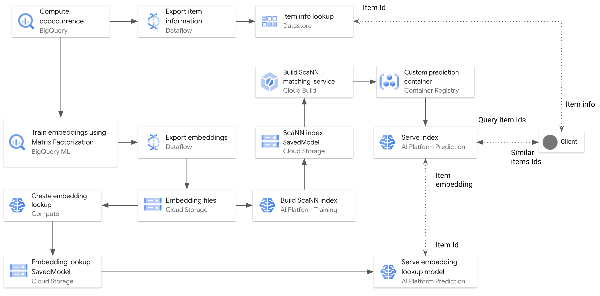

# Real-time Item-to-item Recommendation with BigQuery ML Matrix Factorization and ScaNN

This directory contains a sample code for training and serving embeddings 
for real-time similarity matching. The system utilizes [BigQuery ML Matrix Factorization](https://cloud.google.com/bigquery-ml/docs/reference/standard-sql/bigqueryml-syntax-create-matrix-factorization)
model to train the embeddings, and the open-source [ScaNN framework](https://ai.googleblog.com/2020/07/announcing-scann-efficient-vector.html) to build and
approximate nearest neighbour index.

1. Compute pointwise mutual information (PMI) between items based on their cooccurrences.
2. Train item embeddings using BigQuery ML Matrix Factorization, with item PMI as implicit feedback.
3. Export and post-process the embeddings from BigQuery ML model to Cloud Storage as CSV files using Cloud Dataflow.
4. Implement an embedding lookup model using Keras and deploy it to AI Platform Prediction.
5. Serve the embedding as an approximate nearest neighbor index using ScaNN on AI Platform Prediction for real-time similar items matching.



## Tutorial Dataset

We use the public `bigquery-samples.playlists` BigQuery dataset to demonstrate
the solutions. We use the playlist data to learn embeddings for songs based on their cooccurrences
in different playlist. The learnt embeddings can be used to match and recommend relevant songs.
to a given song or playlist.

## Before you begin

Complete the following steps to set up your GCP environment:

1. In the [Cloud Console, on the project selector page](https://console.cloud.google.com/projectselector2/home/dashboard), select or create a Cloud project.
2. Make sure that [billing is enabled](https://cloud.google.com/billing/docs/how-to/modify-project) for your Google Cloud project. 
3. [Enable the APIs](https://console.cloud.google.com/apis/library)
 required for the solution: Compute Engine, Dataflow, Datastore, AI Platform, Artifact Registry, Identity and Access Management, Cloud Build, and BigQuery.
4. Use BigQuery [flat-rate or reservations](https://cloud.google.com/bigquery/docs/reservations-intro) to run BigQuery ML matrix factorization.
5. Create or have access to an existing [Cloud Storage bucket](https://cloud.google.com/storage/docs/creating-buckets).
6. Create a [Datastore database instance](https://cloud.google.com/datastore/docs/quickstart)  with Firestore in Datastore Mode.
7. [Create an AI Notebook Instance](https://cloud.google.com/ai-platform/notebooks/docs/create-new)  with TensorFlow 2.3 runtime.
8. [Deploy AI Platform Pipelines](https://cloud.google.com/ai-platform/pipelines/docs/setting-up) to run the TFX pipeline.

To go through the tasks for running the solution, you need to open the JupyterLab environment in the AI Notebook and clone the repository:
1. In the AI Platform Notebook list, click Open Jupyterlab. This opens the JupyterLab environment in your browser.
2. To launch a terminal tab, click the Terminal icon from the Launcher menu.
3. In the terminal, clone the `analytics-componentized-patterns` repository:

   ```git clone https://github.com/GoogleCloudPlatform/analytics-componentized-patterns.git```

When the command finishes, navigate to the `analytics-componentized-patterns/retail/recommendation-system/bqml-scann` directory in the file browser.


## Using the Notebooks to Run the Solution

We provide the following notebooks to prepare the BigQuery run environment 
and the steps of the solution:

**Preparing the BigQuery environment**

1. [00_prep_bq_and_datastore.ipynb](00_prep_bq_and_datastore.ipynb) - 
This is a prerequisite notebook that covers:
   1. Copying the `bigquery-samples.playlists.playlist` table to your BigQuery dataset.
   2. Exporting the songs information to Datastore so that you can lookup the information of a given song in real-time.
2. [00_prep_bq_procedures](00_prep_bq_procedures.ipynb) - This is a prerequisite notebook that covers creating the BigQuery 
stored procedures executed by the solution.

**Running the solution**

1. [01_train_bqml_mf_pmi.ipynb](01_train_bqml_mf_pmi.ipynb) - This notebook covers computing pairwise item cooccurrences
to train the the BigQuery ML Matrix Factorization model, and generate embeddings for the items.
2. [02_export_bqml_mf_embeddings.ipynb](02_export_bqml_mf_embeddings.ipynb) - 
This notebook covers exporting the trained embeddings from the Matrix Factorization BigQuery ML Model to Cloud Storage,
as CSV files, using Apache Beam and Cloud Dataflow.
3. [03_create_embedding_lookup_model.ipynb](03_create_embedding_lookup_model.ipynb) - 
This notebook covers wrapping the item embeddings in a Keras model and exporting it
as a SavedModel, to act as an item-embedding lookup.
4. [04_build_embeddings_scann.ipynb](04_build_embeddings_scann.ipynb) - 
This notebook covers building an approximate nearest neighbor index for the embeddings 
using ScaNN and AI Platform Training. The built ScaNN index then is stored in Cloud Storage.

## Running the Solution using TFX on AI Platform Pipelines

We provide a [TFX pipeline](tfx_pipeline) implementation to the solution, as follows:
1. Compute PMI using the [Custom Python function](https://www.tensorflow.org/tfx/guide/custom_function_component) component.
2. Train BigQuery Matrix Factorization Model using the [Custom Python function](https://www.tensorflow.org/tfx/guide/custom_function_component) component.
3. Extract the Embeddings from the Model to a Table using the [Custom Python function](https://www.tensorflow.org/tfx/guide/custom_function_component) component.
4. Export the embeddings as TFRecords using the [BigQueryExampleGen](https://www.tensorflow.org/tfx/api_docs/python/tfx/extensions/google_cloud_big_query/example_gen/component/BigQueryExampleGen) component.
5. Import the schema for the embeddings using the [ImporterNode](https://www.tensorflow.org/tfx/api_docs/python/tfx/components/ImporterNode) component need for the Trainer components.
6. Validate the embeddings against the imported schema using the [StatisticsGen ](https://www.tensorflow.org/tfx/guide/statsgen) component and the [ExampleValidator](https://www.tensorflow.org/tfx/guide/exampleval) component. 
7. Create an embedding lookup SavedModel using the [Trainer](https://www.tensorflow.org/tfx/api_docs/python/tfx/components/Trainer) component.
8. Push the embedding lookp model to a model registry directory using the [Pusher](https://www.tensorflow.org/tfx/guide/pusher) component.
9. Build the ScaNN index using the [Trainer](https://www.tensorflow.org/tfx/api_docs/python/tfx/components/Trainer) component.
10. Evaluate and validate the ScaNN index latency and recall by implementing a [TFX Custom Component](https://www.tensorflow.org/tfx/guide/custom_component).
11. Push the ScaNN index to a model registry directory using [Container-based](https://www.tensorflow.org/tfx/guide/container_component) component.


The implementation of the pipeline is in the [tfx_pipeline](tfx_pipeline) directory. 
We provide the following notebooks to facilitate running the TFX pipeline:
1. [tfx01_interactive](tfx01_interactive.ipynb) - This notebook covers interactive execution of the 
TFX pipeline components.
2. [tfx02_deploy_run](tfx02_deploy_run.ipynb) - This notebook covers building the Docker container image required by
the TFX pipeline and the AI Platform Training job, compiling the TFX pipeline, and deploying the pipeline to 
AI Platform Pipelines.

## Deploying the Embedding Lookup and ScaNN index to AI Platform

After running the solution, an embedding lookup SaveModel and a ScaNN index will be produced.
To deploy these artifacts to AI Platform as prediction service, you can use the
[05_deploy_lookup_and scann_caip.ipynb](05_deploy_lookup_and scann_caip.ipynb) notebook, which covers:
1. Deploying the Embedding Lookup SavedModel to AI Platform Prediction. 
2. Deploying the ScaNN index to AI Platform Prediction, using a Custom Container, for real-time similar item matching. 

The ScaNN matching service works as follows:
1. Accepts a query item Id.
2. Looks up the embedding of the query item Id from Embedding Lookup Model in AI Platform Prediction.
3. Uses the ScaNN index to find similar item Ids for the given query item embedding.
4. Returns a list of the similar item Ids to the query item Id.


## License

Copyright 2020 Google LLC

Licensed under the Apache License, Version 2.0 (the "License");
you may not use this file except in compliance with the License. You may obtain a copy of the License at: http://www.apache.org/licenses/LICENSE-2.0

Unless required by applicable law or agreed to in writing, software distributed under the License is distributed on an "AS IS" BASIS, WITHOUT WARRANTIES OR CONDITIONS OF ANY KIND, either express or implied. 

See the License for the specific language governing permissions and limitations under the License.

**This is not an official Google product but sample code provided for an educational purpose**

